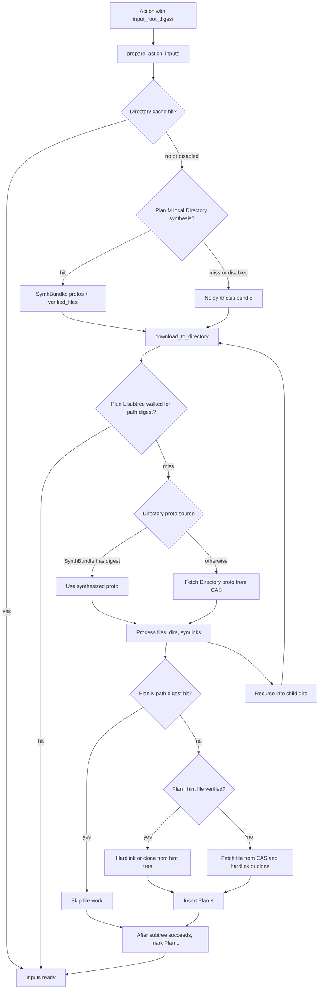
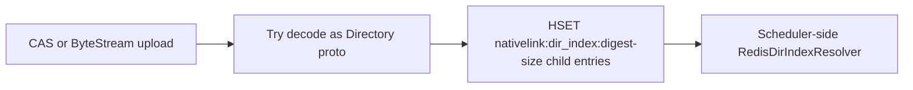

# NativeLink v1 Branch Overview

This document reviews the `v1_branch` work since `9233ad32` (`v1.0.0`) and summarizes the current Plan-letter optimization stack.

The short version: the branch evolved from an optimistic cross-machine push model into a safer model where every action prepares its own inputs, but that local preparation is made cheap by local disk verification, shared in-process caches, Redis-backed walked-directory state, and optional local Directory proto synthesis.

## What Changed Since v1.0.0

### Current End State

- Workers always prepare inputs locally for each action. The removed push/barrier model tried to make correctness depend on Redis-published pending outputs; the current code makes correctness local to `prepare_action_inputs`.
- A complete pre-staged source tree can now avoid CAS reads on the cold input path:
  - Plan M synthesizes Directory protos from local disk.
  - Plan I hardlinks files from local disk after digest verification.
  - Plan K remembers verified `(path, digest)` file pairs across workers in one process.
  - Plan L remembers fully walked `(directory_path, digest)` subtrees, locally or via Redis.
- macOS gets APFS `clonefile()` first, with `hard_link` fallback.
- Timing and counter instrumentation was added so the optimization path is observable.
- macOS arm64 release artifact workflow was added; most upstream workflows were removed from this fork branch.

### Major Feature Groups

| Area | Main files | What improved |
|---|---|---|
| Worker input materialization | `nativelink-worker/src/running_actions_manager.rs`, `nativelink-worker/src/path_digest_cache.rs`, `nativelink-worker/src/local_dir_synthesis.rs`, `nativelink-worker/src/file_digest_check.rs` | Reduced cold and warm input setup cost while keeping CAS fallback correctness. |
| Local disk path mapping | `nativelink-config/src/cas_server.rs`, `nativelink-worker/src/running_actions_manager.rs` | `project_root` remaps action-borne `InputRootAbsolutePath` onto a worker-local path. |
| Redis Directory index | `nativelink-service/src/dir_index.rs`, `nativelink-scheduler/src/dir_index_resolver.rs` | Added a CAS-upload hook and resolver for Directory child metadata. The current scheduler hot path no longer depends on the old pending-output push flow. |
| Timing and diagnostics | `nativelink-util/src/timing.rs`, `nativelink-worker/src/running_actions_manager.rs`, `nativelink-worker/src/path_digest_cache.rs`, `nativelink-scheduler/src/simple_scheduler.rs` | Per-stage timing dumps, CPU user/sys split, Redis pool counters, Plan hit/miss counters, and stricter scheduler slow-cycle warnings. |
| CAS read hot path | `nativelink-util/src/digest_lru.rs` | Digest-keyed LRU cache for small hot blobs. |
| Filesystem behavior | `nativelink-util/src/fs.rs`, `nativelink-util/src/fs_util.rs` | APFS `clonefile()` optimization, safer hardlink/EEXIST behavior, read-only permission handling. |
| Packaging | `.github/workflows/macos-artifact.yaml` | macOS arm64 artifacts are built and published from semver tags on `v1_branch`. |

## Current Input Preparation Flow

The important invariant is fallback safety: Plan M and Plan I only short-circuit after digest verification. Any mismatch or I/O error falls back to the CAS path.

## Plan Reference

### Plan I: Digest-Checked Hint Link

Plan I reuses a pre-staged source tree on local disk. For a file in a Directory proto, the worker checks `hint_root/<file_name>` with the action digest function. If it matches the expected digest, the worker hardlinks or clonefiles that local file into the action destination and skips `populate_fast_store`.

| Property | Details |
|---|---|
| Current status | Active. Default-on via `workers[].local.experimental_digest_checked_hint_link = true` since `1.3.0`. |
| Requires | `InputRootAbsolutePath` or `project_root` must point to a complete local tree. File must exist and hash to the expected digest. |
| Falls back when | Flag is false, hint path is absent, size/content mismatch, I/O error, or link/clone fails. |
| Benefit | Replaces network CAS file reads with local hash plus link/clone. Biggest win for off-LAN or tunnel-bound workers. |
| Metrics | `worker.plan_i.hit`, `worker.plan_i.miss`, `worker.plan_i.verified_reuse`, `worker.cas.populate_fast_store`, `worker.fs.clonefile_or_link`. |
| Main code | `nativelink-worker/src/file_digest_check.rs`, `nativelink-worker/src/running_actions_manager.rs`. |

Legacy Plan I was unsafe because it trusted same-size files. The branch replaced that with full digest verification.

### Plan J: Shared-Tree Path and Idempotent Materialization

Plan J is the shared-tree path behavior around `InputRootAbsolutePath`: actions may use the pre-staged tree path as their work directory, optionally remapped by `project_root`. Directory creation, symlink creation, and link EEXIST handling are intentionally idempotent so repeated actions can run against an already-populated tree.

| Property | Details |
|---|---|
| Current status | Partly active as path derivation and idempotent filesystem behavior. The old "stat-hit" variant is disabled. |
| Requires | Action carries `InputRootAbsolutePath`; optional `workers[].local.project_root` maps origin path to worker-local path. |
| Falls back when | No `InputRootAbsolutePath`: worker uses `{action_directory}/work`. |
| Benefit | Avoids creating a totally separate throwaway input tree when the worker already has the source tree. |
| Risk handled | The unsafe stat-hit shortcut that trusted file size was removed. Plan K or Plan I/CAS must prove file content. |
| Main code | `translate_input_root_path`, `RunningActionImpl::new`, `download_to_directory` in `nativelink-worker/src/running_actions_manager.rs`. |

### Plan K: Path Digest Cache

Plan K is an in-memory map from absolute destination path to verified digest. If the worker knows `path X` already holds digest `D`, it can skip all file work for that file.

| Property | Details |
|---|---|
| Current status | Active. The map is process-shared across all `workers[]` entries in one `nativelink` process. Optional disk persistence since 1.3.11 (`path_digest_cache_persistence`). |
| Requires | A previous successful Plan I or CAS path inserted the `(path, digest)` pair. |
| Falls back when | Path is unseen or digest differs. |
| Benefit | Warm steady-state file materialization becomes an O(1) memory lookup per file. Sharing means one worker warms the cache for sibling workers in the same process. |
| Concurrency | Backed by `RwLock<HashMap<...>>`; hot `contains` reads can run concurrently. |
| Metrics | `worker.plan_k.hit`, `worker.plan_k.miss`; with persistence: `worker.plan_k.persistence.{loaded,dropped_stale,flush}`. |
| Main code | `nativelink-worker/src/path_digest_cache.rs`, `nativelink-worker/src/path_digest_persistence.rs`, `src/bin/nativelink.rs`. |

Plan K is intentionally unbounded today. By default it is wiped on every NL restart; opt in to disk persistence via the top-level `path_digest_cache_persistence` config block to survive restarts (see `docs/plan_k_persistence.md`).

### Plan L: Walked-Directory Cache

Plan L remembers that a Directory subtree has already been fully materialized at a specific destination path. Its key is path-aware: `(directory_path, digest)`.

| Property | Details |
|---|---|
| Current status | Active. Local in-memory provider by default; Redis-backed provider when `workers[].local.shared_walked_dirs_redis_url` is set. |
| Requires | The subtree walk must have completed successfully for that exact destination path. |
| Falls back when | Path differs, digest differs, cache is empty, Redis misses, or Redis is unavailable. |
| Benefit | Skips recursive Directory walks for repeated actions at the same path. Redis can preserve hits across worker restart on the same machine namespace. |
| Safety fix | Earlier digest-only Plan L caused missing files across different destination paths. Current Plan L includes the destination path in the key. |
| Metrics | `worker.plan_l.hit`, `worker.plan_l.miss`, `worker.walked_dirs.*`, `worker.redis_pool.*`. |
| Main code | `nativelink-worker/src/path_digest_cache.rs`. |

Plan K sharing and Plan L provider selection are intentionally split: a process-shared Plan K map must not override each worker's Redis-backed Plan L configuration.

### Plan M: Local Directory Proto Synthesis

Plan M eliminates cold Directory-proto CAS reads when the local hint tree is complete. It recursively walks `hint_root`, hashes files, constructs REAPI `Directory` protos, hashes those proto bytes, and only succeeds if the root digest equals the action's expected input root digest.

| Property | Details |
|---|---|
| Current status | Active behind the same effective precondition as Plan I: `experimental_digest_checked_hint_link = true` and a `hint_root`. |
| Requires | Local tree must encode to byte-identical Directory protos: names sorted, file digests match, executable bits and symlinks match, and node properties must match the original proto shape. |
| Falls back when | Root digest mismatch or any local walk/hash I/O error. |
| Benefit | On hit, skips all CAS Directory proto fetches for the action input tree. It also returns `verified_files`, so Plan I can avoid re-hashing files already verified by synthesis. |
| Metrics | `worker.plan_m.hit`, `worker.plan_m.miss_digest_mismatch`, `worker.plan_m.miss_io_error`, `worker.plan_m.proto_reuse`, `worker.plan_i.verified_reuse`, `worker.download_to_directory.directory_proto_fetch`. |
| Main code | `nativelink-worker/src/local_dir_synthesis.rs`, `prepare_action_inputs` and `download_to_directory` in `nativelink-worker/src/running_actions_manager.rs`. |

Plan M is correctness-preserving because a hit means the locally synthesized proto bytes hash to the same digest CAS would verify.

## How The Plans Stack

| Scenario | Plan M | Plan L | Plan K | Plan I | CAS use |
|---|---:|---:|---:|---:|---|
| Fresh worker, complete pre-staged tree | Hit | Miss then mark | Miss then fill | Hit, often via `verified_reuse` | No Directory or file reads on input path. |
| Fresh worker, no local tree | Miss I/O | Miss then mark | Miss then fill | Miss | Normal CAS Directory and file reads. |
| Warm worker, same path | Usually not reached if Plan L hits | Hit | Not needed for skipped subtrees | Not needed | No input CAS work for cached subtrees. |
| Warm worker, same files under same path but Plan L miss | Maybe hit | Miss | Hit per file | Not needed | Directory fetch may occur unless Plan M hits; files skipped. |
| Local tree stale | Miss digest or Plan I miss | Miss then mark after CAS | Fill from CAS | Falls through | Correct CAS fallback. |

## Redis Directory Index and Pending-Output History

The branch added a Redis Directory index:

This was originally used for a push-based `pending_outputs` design: the scheduler would inspect input trees before dispatch, compare against per-worker state, publish missing files to Redis lists, and block dispatch behind drain/barrier state. That line of work added sequence numbers, atomic publish, background drain, empty-queue heartbeat, and barrier timeouts.

That design was later retired by `a0522866` because correctness depended on cross-machine publish/barrier/drain timing. The current architecture keeps the safer rule: every action walks/materializes its own inputs. As of the current code, `SimpleScheduler` does not hold a `RedisDirIndexResolver`, and worker input correctness does not depend on `pending_outputs`.

The Directory-index code still exists and may be useful for future experiments or diagnostics, but it should not be confused with the current hot path unless it is explicitly rewired.

## Observability Cheat Sheet

The timing dump is emitted by `nativelink_util::timing::dump_to_tracing()`. Worker startup schedules periodic dumps; override with `NATIVELINK_TIMING_DUMP_INTERVAL_SECS` (clamped to 1..3600).

| What to check | Useful metrics or log fields |
|---|---|
| Is Plan M working? | High `worker.plan_m.hit`; high `worker.plan_m.proto_reuse`; low `worker.download_to_directory.directory_proto_fetch`. |
| Is Plan M failing due local tree drift? | High `worker.plan_m.miss_digest_mismatch`. |
| Is Plan I avoiding CAS file reads? | High `worker.plan_i.hit`; high `worker.plan_i.verified_reuse` when Plan M hits; low `worker.cas.populate_fast_store`. |
| Is Plan K warm? | `worker.plan_k.hit` should dominate `worker.plan_k.miss` after first action. |
| Is Plan K persistence absorbing cold-starts? | `worker.plan_k.persistence.loaded` after restart; `worker.plan_k.persistence.dropped_stale` should be ~0 unless the input tree was touched offline; `worker.plan_k.persistence.flush` should tick at the configured interval while inserts happen. |
| Is Plan L warm? | `worker.plan_l.hit` should rise for repeated same-path actions. |
| Is Redis walked-dirs healthy? | `worker.walked_dirs.l1_hit`, `worker.walked_dirs.redis_sismember`, `worker.walked_dirs.redis_sadd`, `worker.redis_pool.hit`, `worker.redis_pool.new_conn`. |
| Is the worker syscall-bound? | `timing:cpu` with high `sys_pct`; then inspect highest `timing:stage` totals. |
| Is scheduler dispatch lagging? | `scheduler.do_try_match.cycle`, `scheduler.match_action_to_worker`, `scheduler.get_queued_operations`, and slow-cycle warns above 100 ms. |

## Configuration Reference

| Field | Applies to | Effect |
|---|---|---|
| `workers[].local.experimental_digest_checked_hint_link` | Worker | Enables Plan I and Plan M. Default `true` on this branch. Set `false` for workers without a reliable local tree. |
| `workers[].local.platform_properties.InputRootAbsolutePath` | Worker/action matching | Carries the shared-tree root used as `work_directory` and `hint_root`. |
| `workers[].local.project_root` | Worker | Remaps action-origin paths to worker-local paths. Useful when the source tree lives at different absolute paths on different machines. |
| `workers[].local.shared_walked_dirs_redis_url` | Worker | Enables Redis-backed Plan L provider. |
| `workers[].local.machine_id` | Worker | Namespaces Redis walked-dirs state per machine. |
| `byte_stream[].dir_index_redis_url` | CAS/ByteStream service | Records Directory proto children into Redis on upload. Not required for current Plan I/K/L/M hot path. |
| `cas[].dir_index_redis_url` | CAS service | Same Directory-index hook for BatchUpdateBlobs/CAS upload path. |
| `schedulers.simple.dir_index_redis_url` | Scheduler config | Config field exists for the Redis resolver line of work, but the current scheduler hot path does not use it. |
| `path_digest_cache_persistence` (top-level, since 1.3.11) | Process | Opt-in disk snapshot of Plan K. `path` (required) + `flush_interval_seconds` (default 30). Survives NL restart with a stat-gate-validated reload. See `docs/plan_k_persistence.md`. |

## How Much Each Feature Helps

These are qualitative expectations from the code path; use the metrics above for actual deployment numbers.

| Feature | Best case | Typical help | Main limit |
|---|---|---|---|
| Plan M | Eliminates all CAS Directory proto reads on cold input materialization. | High when local tree matches action input tree. | Fails open to CAS if local proto bytes differ, e.g. mode/symlink/property drift. |
| Plan I | Eliminates CAS file blob reads on cold input materialization. | Very high for off-LAN workers; local hash/link is much cheaper than tunnel-bound CAS fetch. | Cold path still hashes files unless Plan M verified them first. |
| Plan K | Skips all per-file work on warm repeated paths. | Very high after first action; process-shared across worker configs. With `path_digest_cache_persistence` enabled, also survives NL restart (cold-restart-to-steady-state drops from ~7 min to ~30 s on the inverted-topology chromium harness). | Path-specific. Without persistence, wiped on every restart. |
| Plan L | Skips recursive Directory walking on warm repeated subtrees. | High for repeated same-path builds, especially with Redis persistence. | Must be path-aware; no benefit for different destination paths. |
| APFS clonefile | Avoids APFS hardlink contention and shares blocks copy-on-write. | High on macOS with many parallel links of shared inputs. | macOS/APFS only; falls back to hardlink. |
| Digest LRU | Avoids repeated disk reads for small hot CAS blobs. | Moderate to high on scheduler/CAS hosts serving repeated headers/toolchain blobs. | Per-process memory budget; large blobs intentionally bypass it. |
| Scheduler concurrent dispatch | Avoids serial dispatch bottleneck. | High when many queued actions need assignment. | Worker selection still serializes where required to avoid double-dispatch. |

## Retired or Superseded Pieces

| Piece | Status | Why |
|---|---|---|
| Legacy Plan I size-only hint link | Replaced | Same-size different-content files could be accepted incorrectly. |
| Plan J stat-hit | Disabled | Size/stat checks do not prove content. |
| Old digest-only Plan L | Replaced | Same digest walked into one path could incorrectly skip materialization in another path. |
| Push-based `pending_outputs` drain/barrier/heartbeat | Retired | Correctness depended on cross-machine Redis timing. Current input prep is action-local. |
| CAS-journal scheduler prepublish flow | Not current hot path | Directory-index code remains, but current `SimpleScheduler` does not wire it into dispatch. |

## File Map For Future Work

- `nativelink-worker/src/running_actions_manager.rs`: input preparation hot path and Plan I/K/L/M integration.
- `nativelink-worker/src/local_dir_synthesis.rs`: Plan M synthesis implementation and tests.
- `nativelink-worker/src/path_digest_cache.rs`: Plan K map and Plan L providers.
- `nativelink-worker/src/file_digest_check.rs`: digest verification for Plan I.
- `nativelink-config/src/cas_server.rs`: worker config fields such as `project_root`, `shared_walked_dirs_redis_url`, and `experimental_digest_checked_hint_link`.
- `src/bin/nativelink.rs`: process-level shared Plan K map construction.
- `nativelink-util/src/timing.rs`: timing/counter registry and CPU split.
- `nativelink-util/src/digest_lru.rs`: small CAS blob LRU.
- `nativelink-service/src/dir_index.rs`: Directory-index upload hook.
- `nativelink-scheduler/src/dir_index_resolver.rs`: Redis Directory-index resolver, currently not on the main scheduler hot path.
